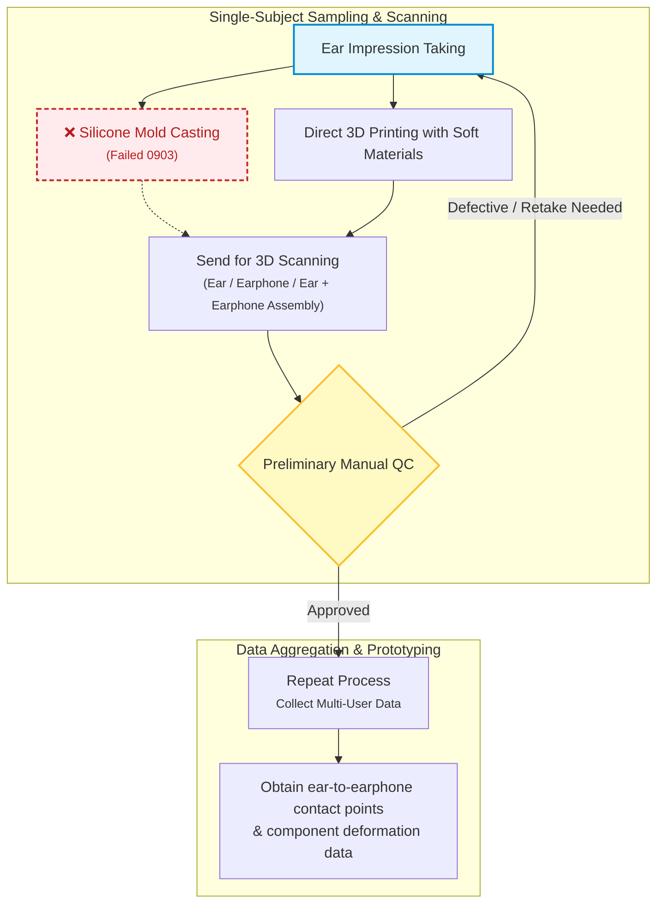
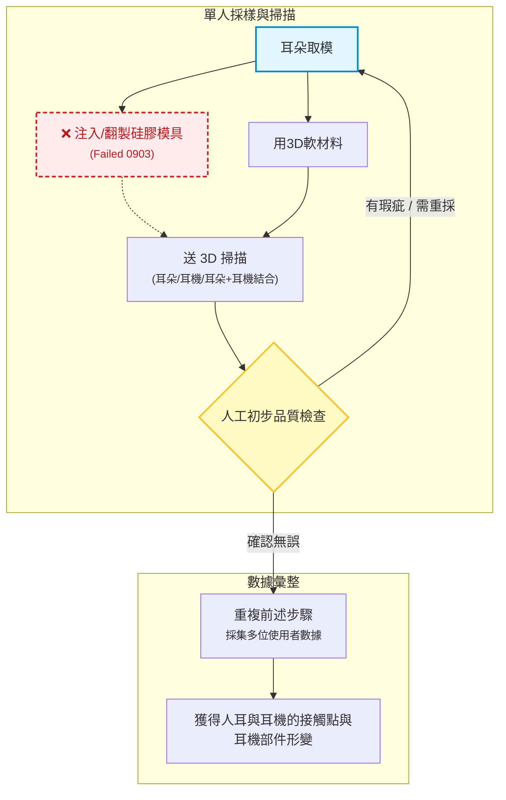

# Custom Earphone / Earmold Fabrication & R&D Workflow

## Flowchart

# Action Items
1. **Ear Impression Taking** (Pilot test on 1 subject, **Bo Shishi**)
2. **Find Soft Silicone Casting Materials** (both transparent and opaque)
   - Preliminary tests using own lab materials (Failed, 0903, **Wang Liren**)
3. **3D Print Ear Models with Flexible Materials**
   - Prerequisite: 3D scan the ear first, then build the cast-ready STL in Meshmixer.
   - Flexible materials + 3D printer (Ongoing, **Shimada**, 0904)
4. **3D Scanning**
   - Batch scanning (multiple subjects: 5+ / 20+; multiple earphone models: 3+)
   - Single subject (Done, **Bo Shishi**)
   - Find external 3D scanning vendors (Plan B)
   - Purchase or rent a 3D scanner (Ongoing, 2 weeks, 9/17, **Prof. Okubo, Shimada**)
5. **Preliminary Manual Inspection**
   - Obtain digital 3D overlap data of earphones fitted into ear canals; map contact/fit zones
   - If results are suboptimal, identify and implement upstream workflow adjustments

# Notes
1. Surveys
   - Map out ear pain/pressure points via diagrammatic questionnaire
   - Multi-earphone fit and pain evaluation questionnaire
2. Feedback (Shimada, 20260903)
   - 3D printers here only handle rigid materials; soft materials must be outsourced upstream, taking about 2 weeks per run, so it is best to submit ear molds for many subjects in a single batch.
   - Ear mold analysis and follow-up experiment design must account for the side-sleeping posture.
   - AI and tooling support (**Wang**)

# 客製化耳機／耳模製作與研發流程

# Action Item
1. 耳朵取模 (先試做1人, **Bo Shishi**)
2. 寻找软硅胶翻模材料（透明、不透明两种）
   - 王立人用自己lab材料做初步實驗 (Failed, 0903, Wang Liren)
3. 软质材料3D打印耳朵模型
   - 前置: 要先3D掃耳朵，再用meshmixer製作翻模後的STL。
   - 軟材料 + 3D printer (Ongoing, **Shimada**, 0904)
4. 掃描
   - 批量 (多人(5+/20+)/多耳機(3+))
   - 1人份 (Done, **Bo Shishi**)
   - 找掃描公司 (Plan B)
   - 買/租借掃描儀 (Ongoing, 2weeks, 9/17, **Prof. Okubo, Shimada**)
5. 人工初步檢查
   - 获得数字化耳机与耳朵重叠三维数据---贴合部位绘图
   - 檢查如果不理想，需判斷前面流程怎麼修改

# 附註
1. survey
   - 耳朵疼痛部分绘图问卷调研
   - 多款耳机试用疼痛问卷调研
2. Feedback (Shimada, 20260903)
   - 用3D printer是硬材，如果要軟材需送上游做，一次耗時約2週，所以最好一次送多人的ear mold。
   - 耳模分析及後續實驗設計需考慮側睡情況
   - AI與工具協助 (**Wang**)