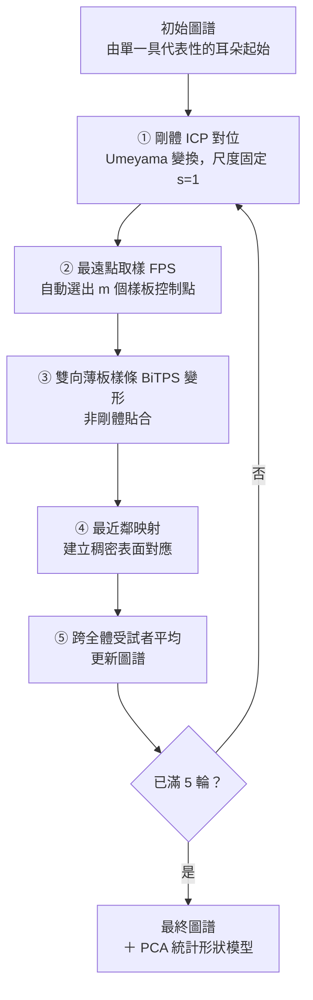

# 免標註的耳甲碗圖譜管線（完整版）

**ICP ＋ 雙向薄板樣條變形，把每隻耳朵直接配準到圖譜上**

*Sensors* 2026 ｜ 文獻導讀 ｜ 完整工作版

> 📌 **這一份與 [SLIDES-auricular-bowl-atlas.md](SLIDES-auricular-bowl-atlas.md) 的差別。**
> 那一份是**報告版**：9 頁、去掉所有證據標記與過程註記、收在配準誤差。
> 這一份是**工作版**：保留全部證據等級標記、補回被刪的統計與驗證章節、加入後續查證所得（初始圖譜、誤差指標的侷限、Figure 4 判讀、尺寸保留與否、可複現性缺口）。要引用數字或對外主張時，以這一份為準。

---

## 1. 出處與核實方式

Zhang, T., Lee, T.K.W., Huang, J., Leung, K.L., Fu, S.N.
**An Annotation-Free Pipeline for 3D Auricular Bowl Atlas Construction and Statistical Shape Modelling from Surface Scans.**
*Sensors*, **2026**, 26(11): 3493.

| 項目 | 值 |
|---|---|
| DOI | [10.3390/s26113493](https://doi.org/10.3390/s26113493) |
| PMID | 42281011 |
| PMCID | [PMC13259287](https://europepmc.org/articles/PMC13259287) |
| 授權 | 開放取用（Open Access），CC BY |
| 首次發表日 | 2026-06-01 |
| 研究單位 | 香港理工大學（倫理審查 HSEARS20230705002） |

> ⚠️ **年份易誤記為 2025。**《Sensors》卷號 26 對應 **2026** 年，本文為 26 卷 11 期。

> 📌 **本簡報的核實方式**：全文經 Europe PMC API（`fullTextXML`）取得後逐條轉錄；Figure 4 由 Europe PMC 圖檔端點直接下載原圖判讀。MDPI 官網對自動抓取回傳 403，故改走 Europe PMC。核實日期 2026-09-01。

---

## 2. 一句話總結與三個宣稱

**不需要任何人工標記的地標，就能把 50 隻耳朵全部配準到同一個耳甲碗（auricular bowl）圖譜上，並從中導出一個可解釋的低維統計形狀模型。**

| 宣稱 | 內容 | 證據等級 |
|---|---|---|
| **免標註可行** | 全流程無人工地標，控制點由最遠點取樣自動選出 | 【文獻】 |
| **配準品質足夠** | 五輪迭代後平均最近鄰距離 0.30mm、覆蓋率 0.98 | 【文獻】 |
| **產出的尺寸可信** | 模型導出的碗高／碗寬對上人工量測 Pearson r ≥ 0.98、ICC ≥ 0.98 | 【文獻】 |

---

## 3. 它要解決的問題

三維耳部形態對下列設計都是關鍵：入耳式助聽器（in-the-ear hearing aids）、耳機（earphones）、經皮耳迷走神經刺激（transcutaneous auricular vagus nerve stimulation, taVNS）電極、耳廓重建（auricular reconstruction）。

**但**：原文指出，多數既有的耳形模型**仍依賴人工放置的地標**（manually placed landmarks）。【文獻】

**人工地標的代價**：

| 問題 | 說明 |
|---|---|
| 人力成本 | 每隻耳朵都要有人點座標 |
| 標註者間變異 | 同一個「耳屏頂點」不同人點在不同位置 |
| 難以規模化 | 樣本數一大就做不動 |

> 【推論】此三項為本簡報對「依賴人工地標」後果的整理，**原文並未逐條列出**，僅陳述「多數模型仍依賴人工地標」此一現況。

**本文的做法**：把地標整條路徑拿掉，改用「反覆把每隻耳朵變形貼到當前圖譜上」建立對應關係。

---

## 4. 它做的是哪一塊：耳甲碗的確切範圍

論文明確以**排除耳垂的耳甲碗**（lobule-excluded auricular bowl）為目標區域。【文獻】

| | 解剖構造 |
|---|---|
| ✅ **納入** | 耳甲腔（cavum conchae）、耳甲艇（cymba conchae）、三角窩（triangular fossa）、對耳輪（antihelix） |
| ❌ **排除** | 耳垂（lobule）、耳道開口（ear canal opening） |

**裁切方式**：於 Geomagic Design X 中**人工裁切**出區域邊界，再等向重新網格化（isotropically remeshed）至約 **4×10⁴ ～ 6×10⁴** 個三角面。【文獻】

> ⚠️ **「免標註」指的是免地標，不是全自動。** 區域裁切這一步仍是人工的——它只需框出一塊範圍，不需點出具名的解剖點位，兩者的重複性要求差很多。【推論：此對比為本簡報的判讀，原文僅陳述裁切以 Geomagic 手動完成】
>
> ⛔ **範圍比中文「耳甲碗」的字面意思大。** 它把三角窩與對耳輪也含進來，也就是連碗緣外側那一圈結構一起納入。**任何要引用其尺寸的人都須先確認範圍定義。**

---

## 5. 資料

| 項目 | 內容 | 證據等級 |
|---|---|---|
| 樣本數 | **50 隻耳朵／50 位受試者** | 【文獻】 |
| 側別 | **僅右耳** | 【文獻】 |
| 性別 | 男 25、女 25 | 【文獻】 |
| 年齡 | **13 – 45 歲** | 【文獻】 |
| 取得方式 | EinScan Pro HD 結構光掃描器（Shining 3D） | 【文獻】 |
| 空間解析度 | 約 **0.2 mm** | 【文獻】 |
| 前處理 | Geomagic Design X 人工裁切 → 等向重新網格化至 4×10⁴–6×10⁴ 三角面 → 取樣 **20,000 點**（每位受試者固定同數） | 【文獻】 |
| 資料集性質 | 自行採集，**未使用公開資料集** | 【文獻】 |

**外推限制：**

1. **只有右耳。** 本研究不涉及左右差異，其圖譜與統計形狀模型不能直接套用到左耳（需鏡射，而鏡射是否成立本文未檢驗）。
2. **年齡上限 45 歲。** 樣本不含中高齡族群，下限 13 歲則含青少年。要外推到年長使用者須另有依據。

> 📌 **取樣點數兩邊相等**（圖譜與每隻耳朵皆 20,000 點）。這一點在理解第 10 頁的「多對一」現象時很重要。【文獻】

---

## 6. 管線總覽

外層共執行 **K = 5** 輪迭代（five atlas iterations）。【文獻】

**兩層迴圈要分清楚：**

| 層級 | 迴圈內容 | 終止條件 |
|---|---|---|
| **內層** | ICP 自身的反覆對位 | 平均平方最近鄰距離的降幅低於預設容差【文獻】（**容差數值未給**【待核】） |
| **外層** | 整條管線（ICP → FPS → BiTPS → 對應 → 平均） | 固定 **K = 5** 輪【文獻】 |

---

## 7. 步驟①：剛體 ICP 對位

**ICP ＝ 迭代最近點（iterative closest point）。** 反覆地①假設「離我最近的點就是對應點」→②解出讓配對距離平方和最小的剛體變換→③套用後重新找最近點，直到改善幅度低於容差。配對與對位互相帶動，一開始錯的配對會隨形狀靠近而變準。

**目的**：把每隻耳朵擺到與當前圖譜同一位置與朝向——這一步**只搬動、不改形狀**。

| 設定 | 值 | 意義 |
|---|---|---|
| 變換求解 | Umeyama 變換 | 由點對應解出最佳剛體變換的標準閉式解【文獻】 |
| **尺度** | **固定 s = 1** | **不做縮放**——耳朵的絕對大小被保留為真實個體差異【文獻】 |
| 取樣點數 | 每個網格 20,000 點 | 依三角形面積加權取樣【文獻】 |
| 收斂條件 | 平均平方最近鄰距離降幅低於容差 | 【文獻】，容差值未給【待核】 |

> ⚠️ **「剛體」（rigid）意味著只准旋轉與平移**，整個形狀像硬板一樣被搬動。ICP 對完之後兩隻耳朵只是擺到了同一位置與朝向，**形狀差異一點都沒消掉**——那是下一步的工作。ICP 另一個已知性質是只保證收斂到局部最佳解。【推論：ICP 演算法的一般性質，非原文陳述】

> 🔑 **`s = 1` 是全篇最關鍵的一個設計選擇。** 它決定了最終模型保留的是 **form（形狀＋大小）** 而非 **shape（純形狀）**。詳見第 18 頁。

---

## 8. 步驟②：最遠點取樣（FPS）

原文：*"To drive the non-rigid registration, m uniformly distributed template landmarks Q were selected from the atlas using farthest point sampling (FPS)."*【文獻】

作法：每次挑一個離已選點集最遠的點，如此反覆。形式上是

> **p₍ₖ₊₁₎ = argmax over p ∈ P\S of d(p, S)**，其中 **d(p,S) = min over s∈S of ‖p − s‖**

> 🔑 **這一步就是「免標註」的關鍵。**
> 傳統做法：人工點出「耳屏頂點」「耳輪腳起點」等**具名**地標當控制點。
> 本文做法：FPS 選出的控制點**沒有解剖名稱**，只保證在表面上分布均勻。變形只需要「一組分布得開的控制點」，不需要它們有名字。

> ⚠️ **控制點數量 m 未給。**【待核】原文只寫 *m uniformly distributed template landmarks*，沒有數值。這直接影響變形的自由度，是可複現性上的實質缺口。

---

## 9. 步驟③：雙向薄板樣條（BiTPS）

薄板樣條是一種非剛體變形：給定控制點的位移，求出讓整個曲面「彎曲能量最小」的平滑變形場。比喻是一張薄金屬片——推幾個點，整片會平順地跟著彎，不會出摺，因為彎折要花能量而金屬片會走最省力的路徑。

**標準形式**（Bookstein）：

> **T(x) = Mx + t + Σₖ cₖ · Φ(‖x − sₖ‖)**

**核函數的中心 sₖ 必須是該映射的「來源側」控制點**，與自變量 x 同在一個座標系。

**「雙向」的意思**：不只把樣板往目標推，也把目標往樣板拉，兩個方向一起解。【文獻：原文稱 bidirectional TPS】

> ⚠️ 原文未詳述雙向相較單向在數學上的完整差異，也**未給正則化參數 λ 的數值**【待核】。其**效果**可由第 13 頁的誤差表直接看出：BiTPS 欄的四項指標在每一輪都明顯優於純 ICP 欄。

---

## 10. 步驟④：最近鄰映射建立稠密對應

變形後，樣板上的每個點去找目標表面上離它最近的點：

> **c(i) = argmin over j of ‖T(aᵢ) − eⱼ‖**

這就建立了**稠密表面對應**（dense surface correspondences）。【文獻】

「稠密」意味著對應不是幾十個地標，而是整個曲面上**兩萬個取樣點逐點都有配對**。這是後續能做主成分分析的前提：**所有耳朵必須用同樣長度、同樣語意順序的向量來表示**（第 7 號點在每隻耳朵上都要指同一個地方）。

> ⚠️ **注意 `T(aᵢ)` 不是原始圖譜，是被 BiTPS 掰過之後的圖譜。** 抓最近鄰的時候，樣板已經貼在那隻耳朵上了。

> ⛔ **最近鄰對應的兩個固有缺陷**（【推論】：演算法的一般性質，原文未討論）
> 1. **多對一**：多個樣板點可能抓到同一個耳朵點。圖譜與耳朵取樣點數相同（各 20,000）時尤其明顯。
> 2. **不對稱**：耳朵→圖譜的映射會得到跟圖譜→耳朵不同的配對。論文另列 symmetric Chamfer-L2 即是為補此點。

---

## 11. 步驟⑤：跨受試者平均更新圖譜

把 50 隻耳朵在對應之後的形狀取平均，得到新的圖譜，回到步驟①再跑一輪。【文獻】

**為什麼要迭代 5 輪**：初始圖譜只是「某一隻具代表性的耳朵」，帶著那個人的個體特徵。每平均一次，圖譜就更接近母體的平均形狀，下一輪的配準也就更容易。

> 🔁 **④ 與 ⑤ 互為前提。** 好的對應需要好的樣板（樣板離太遠就得硬掰，硬掰會讓最近鄰變得任意）；好的樣板又需要對應（沒有共同索引就無法平均）。誰都不能先，所以只能兩個都先做得爛，然後靠重複互相拉抬。【推論】

---

## 12. 初始圖譜從哪裡來

原文：

> *"The atlas A⁽⁰⁾ was initialized as a single ear surface from the training set that was representative in terms of overall size and appearance."*【文獻】

| | 狀態 |
|---|---|
| ✅ 起點是**一隻真人的耳朵**，不是合成形狀 | 從那 50 隻裡挑一隻 |
| ✅ 挑選有陳述理由 | 「在整體尺寸與外觀上具代表性」 |
| ❌ **但沒有操作型定義** | 最接近平均尺寸？中位數？掃描品質最好？**原文未定義**【待核】 |

**論文對初始值敏感度的說法**：

> *"In practice, the final atlas was found to be insensitive to the exact choice of the initial subject."*【文獻】

> ⛔ **這句話沒有任何數據支撐。** 全文中沒有換不同起始耳朵重跑的對照實驗、沒有 ablation、沒有量化比較。**它是一句斷言，不是一個結果。**【推論：此判定基於本次全文檢索未發現相關實驗】
>
> 這是一個容易驗證卻未驗證的宣稱——換 5 隻不同起始耳各跑一次、比較最終圖譜差異即可。

---

## 13. 結果：五輪迭代的配準誤差

四項指標，第 1 輪 → 第 5 輪：【文獻，全部為原文數值】

| 指標 | 單純 ICP：第1輪 → 第5輪 | **加上 BiTPS：第1輪 → 第5輪** |
|---|---|---|
| 平均最近鄰距離 (mm) | 2.10 → 0.93 | **0.71 → 0.30** |
| 最大最近鄰距離 (mm) | 8.92 → 2.97 | **3.73 → 1.32** |
| 對稱 Chamfer-L2 距離 | 13.46 → 5.47 | **1.47 → 0.71** |
| 覆蓋率（coverage，τ 門檻） | 0.61 → 0.89 | **0.92 → 0.98** |

### 這張表要怎麼讀

> ⚠️ **兩欄不是「兩種互斥方法的比較」。** ICP 是剛體對位，BiTPS 是接在 ICP 之後的非剛體變形——它們是同一條管線的前後兩段。並列是為了顯示 BiTPS 這一段帶來多少額外增益。

1. **迭代有效**：每一欄從第 1 輪到第 5 輪都在改善，四項指標無例外。
2. **BiTPS 貢獻很大**：即使只跑第 1 輪，BiTPS 的平均誤差（0.71mm）就已優於 ICP 跑滿五輪的結果（0.93mm）。
3. **最終量級**：平均 0.30 mm。對照掃描器本身約 0.2 mm 的空間解析度，配準殘差已接近量測解析度的量級。【推論：此對照為本簡報所做，原文未並列此二數字】

> ⚠️ **只有首尾兩輪的數值可用。** 中間第 2、3、4 輪的數字原文未列（僅以 Figure 3 折線呈現）。要畫收斂曲線的人請注意。【待核】

---

## 14. 這四個誤差指標到底在量什麼

### 最近鄰距離（nearest-neighbour distance）

配準完之後，對樣板上**每一個點**找目標面上**離它最近的點**，量兩點距離。平均 → mean NN distance；最大 → max NN distance。

### 覆蓋率（coverage）

原文定義：*"Coverage is defined as the fraction of template points whose nearest-neighbour distance to the warped sample is below a threshold τ"*（Equation 15）【文獻】

> ⚠️ **門檻 τ 的數值未給。**【待核】沒有 τ 就無法解讀 0.98 的實際意義——τ 取 1mm 和取 0.1mm 的 0.98 是完全不同的品質宣稱。

### 對稱 Chamfer-L2

原文給了定義式（兩個點集互相取最近鄰、平方距離、雙向合計）。「對稱」即為補償最近鄰的方向性。【文獻】

### ⛔ 三個容易誤讀的地方

**① 不是「地標對地標」的距離。** 是點到面的最短距離，完全不涉及解剖命名——這正是免標註管線唯一能用的誤差量。

**② 有方向性。** 論文原文只寫「mean and maximum nearest-neighbour distance」，**沒有明講是哪個方向**。從它另外獨立列出 symmetric Chamfer 推斷應為單向，但這是本簡報的判讀。【推論】

**③ 系統性偏低，是樂觀的指標。** 最近鄰永遠挑最近的點，所以**就算對應在解剖上完全錯了，這個數字仍然可以很小**。樣板點沿著耳甲壁滑了 3mm——解剖上對錯了位置，但因為壁面連續，旁邊永遠找得到很近的點。

> **所以「mean NN distance = 0.30 mm」證明的是「兩個面貼得很緊」，不等於「每個點都對到正確的解剖位置」。**【推論】

---

## 15. 結果：統計顯著性

跨五輪迭代的指標變化以 **Friedman 檢定**（無母數、重複量測）驗證：

> **χ²₍₄₎ ≥ 152.8，p < 10⁻³¹**（所有指標皆然）【文獻】

| 項目 | 說明 |
|---|---|
| 為何用 Friedman | 同一批 50 隻耳朵在五輪迭代下重複量測，屬相依樣本；且誤差分布不假設常態 |
| 自由度 4 | 對應五輪迭代（5 − 1 = 4） |
| 「≥ 152.8」 | 這是所有指標中的**最小值**，即最不顯著的那一項也達到此水準 |

> ⚠️ **這個檢定回答的是「迭代之間有沒有差異」，不是「配準夠不夠好」。** 後者要看第 13 頁的絕對數值與第 19 頁對上人工量測的一致性。p 值極小很大程度來自 n = 50 的重複量測設計，**不應解讀為效果量大**。【推論】

---

## 16. 判讀 Figure 4

圖上方標題：**"Atlas (mean ear) with different iteration counts"**

| | 是什麼 |
|---|---|
| **5 個直欄** | 迭代次數 k = 1、2、3、4、5【文獻】 |
| **3 個橫列** | **同一個圖譜的三個不同攝影機視角**（非不同耳朵、非不同受試者） |
| **顏色** | 表面曲率（surface curvature），色標 −1.0 ～ 1.0。**不是誤差、不是位移** |

**第 2 列為何看起來完全不同**：那是近乎正側／邊緣的視角。第 1、3 列從碗的正面附近看進去，看得到耳甲腔凹槽與對耳輪隆起；第 2 列把同一形狀轉到幾乎側視，碗被壓扁成低矮剖面，看到的是**厚度**而非**輪廓**。

> ⚠️ **圖說完全沒有解釋三個橫列是什麼。** 它只說明 5 個直欄是迭代次數，對三個視角一字未提，也沒有列標籤。讀者只能自行推斷。這是原文圖說的疏漏。【推論】

---

## 17. 統計形狀模型（SSM）與主成分

有了稠密對應，50 隻耳朵就都是同維度的向量，可直接做**主成分分析**（principal component analysis, PCA）。

| 項目 | 內容 | 證據等級 |
|---|---|---|
| 模態保留準則 | 保留累積解釋變異達 **99%** 的前 K 個模態；**K 由此準則自動決定** | 【文獻】 |
| **K 的實際數值** | **未給** | 【待核】 |
| **各主成分個別變異解釋百分比** | **未給** | 【待核】 |
| 主成分的整體詮釋 | 被詮釋為耳高、耳寬、深度與耳甲形態 | 【文獻】 |
| 模態 2 | 主要捕捉碗的**水平開口**；正分數對應耳甲腔與耳甲艇變寬 | 【文獻・僅由檢索摘錄核實，全文抓取未重現】 |
| 視覺化 | 以前兩個主成分的分數散布圖呈現受試者層級的變異 | 【文獻】 |

---

## 18. 尺寸有沒有被保留：form vs shape

**有，而且是刻意保留的。**

因為第①步的 ICP **把尺度鎖死在 s = 1**，只做旋轉與平移，不做縮放。每隻耳朵進到後續流程時還是它的真實大小。

| | 移除什麼 | 剩下什麼 |
|---|---|---|
| 典型 SSM（Generalized Procrustes Analysis） | 平移 ＋ 旋轉 ＋ **縮放** | 純形狀（**shape**），大小資訊丟失 |
| **本論文** | 平移 ＋ 旋轉 | **形狀 ＋ 大小**（形態學術語：**form**） |

**最硬的證據**：模型導出的碗高、碗寬能對上人工量測的絕對毫米數（r ≥ 0.98）。**若大小被歸一化掉，這個驗證根本不可能做**——size-free 的模型無法輸出「這隻耳朵的碗高是 X mm」。

> ⚠️ **兩個要小心的地方**
> 1. **「PC1 ＝ 純大小」是推論，不是原文結果。** 保留 scale 的 SSM 第一模態通常由整體大小主導，但這是慣例不是定理，而論文未報告各 PC 的個別變異百分比。【推論】
> 2. **即使保留 scale，主成分也不會乾淨切成「純大小」與「純形狀」。** 大耳朵往往不只是小耳朵等比放大（**異速生長 allometry**），PC1 實際上多半是兩者的混合。【推論】

**若反而需要 size-free 特徵**：論文未提供，須自行改為完整 GPA（允許縮放）或把 PC1 迴歸掉。兩者都不等價，也都不是論文做的事。

---

## 19. 驗證：模型導出的尺寸 vs 人工量測

**比對對象**：由統計形狀模型導出的碗高、碗寬 vs 在 Geomagic Design X 中人工量測的三維網格尺寸。

### 幾何定義

取裁切後耳廓的四個極值點：

| 縮寫 | 全名 | 位置 |
|---|---|---|
| SEP | superior extremal point | 上緣極值點 |
| IEP | inferior extremal point | 下緣極值點 |
| AEP | anterior extremal point | 前緣極值點 |
| PEP | posterior extremal point | 後緣極值點 |

> **碗高 H = y(SEP) − y(IEP)**（上下向範圍）
> **碗寬 W = x(AEP) − x(PEP)**（前後向範圍）【文獻】

> ⛔ **這是裁切區域的極值點包絡尺寸，不是具名地標之間的距離。**
> 名稱同樣叫「高」「寬」，但它量的是「這塊被裁出來的曲面在某個軸向上跨多遠」，隨**裁切邊界**與**座標軸朝向**而變。與任何以具名解剖點定義的耳部尺寸**不可直接互換**。

### 一致性統計【文獻，全部為原文數值】

| 量 | Pearson r | Spearman ρ | ICC(A,1) | 平均差 ± SD | 一致性界限（LoA） |
|---|---|---|---|---|---|
| 碗高 | 0.995 | 0.987 | 0.993 | 0.24 ± 0.41 mm | −0.57 ～ 1.05 mm |
| 碗寬 | 0.981 | 0.968 | 0.991 | 0.18 ± 0.35 mm | −0.51 ～ 0.87 mm |

> ⚠️ **未取得**：碗高、碗寬的**絕對數值**（平均、標準差、範圍，單位 mm）。原文只給一致性統計，沒有描述性統計。**所以這篇無法直接提供「耳甲碗有多大」的數字。**【待核】

---

## 20. 圖譜尺度縮水與事後修正

Figure 4 圖說：

> *"the global scale of the atlas gradually decreases, reflecting improved anatomical alignment without distortion of fine folds. The final atlas is rescaled to match the mean ear dimensions of the training set for subsequent statistical analysis."*【文獻】

作者也在方法段承認：在最近鄰對應下的樣板更新階段出現**輕微的圖譜尺度下降**，並以事後重新縮放處理。【文獻】

> 📌 **這一項值得注意，因為它直接影響絕對尺寸。** 第 7 頁提到 ICP 刻意固定 s = 1 以保留真實大小；若圖譜在更新階段又悄悄縮水，保留下來的尺度就會偏掉。作者察覺並做了修正，但**修正是事後的重新縮放，不是把成因消掉**。【推論】

---

## 21. 論文沒有給的東西（可複現性缺口）

本次全文逐項查證的結果——**幾乎每一個可複現性關鍵參數都缺**：

| 缺什麼 | 影響 |
|---|---|
| FPS 控制點數 **m** | 直接決定變形自由度，是 BiTPS 行為的主要旋鈕 |
| TPS 正則化參數 **λ** | 決定貼合 vs 平滑的取捨 |
| ICP 收斂容差 | 決定內層迭代何時停 |
| 覆蓋率門檻 **τ** | **沒有 τ，0.98 這個數字無法解讀** |
| PCA 保留模態數 **K** | 模型維度未知 |
| 各主成分個別變異百分比 | 無法判斷哪個模態重要 |
| 碗高／碗寬的絕對值（mm） | 無法引用為解剖尺寸 |
| 第 2–4 輪的誤差數值 | 只能看首尾 |
| **程式碼與資料可用性聲明** | 全文未見 |
| **Limitations／侷限性專節** | **全文未見** |

> ⛔ **結論：這篇論文按現有內容無法被重新實作。** 方法的骨架清楚，但把它跑起來所需的每一個數值幾乎都不在文章裡。【推論：此判定基於本次全文逐項檢索】

---

## 22. 已知侷限總表

| 類別 | 侷限 | 來源 |
|---|---|---|
| 樣本 | 僅右耳，未檢驗鏡射是否成立 | 【文獻】 |
| 樣本 | 年齡 13–45，無中高齡 | 【文獻】 |
| 樣本 | n = 50，非公開資料集 | 【文獻】 |
| 範圍 | 含三角窩與對耳輪，比字面「耳甲碗」大 | 【文獻】 |
| 流程 | 區域裁切仍為人工 | 【文獻】 |
| 流程 | 初始圖譜選法無操作型定義 | 【文獻】 |
| 流程 | 「對初始值不敏感」無數據支撐 | 【推論】 |
| 指標 | 最近鄰距離系統性偏低，低值 ≠ 對應正確 | 【推論】 |
| 指標 | 最近鄰對應多對一且不對稱 | 【推論】 |
| 尺度 | 圖譜更新時縮水，僅事後重新縮放 | 【文獻】 |
| 尺寸 | 碗高／碗寬為極值點包絡，非具名地標距離 | 【文獻】 |
| 複現 | m、λ、τ、K 等關鍵參數全缺 | 【推論】 |
| 文件 | 無侷限性專節、無程式碼／資料聲明 | 【推論】 |

---

## 23. 對本專案的可用性評估

### 為什麼這篇跟我們有關

[Part 2.4.5](cn/02-anthropometric-basis.md) 記錄的缺口是：**需 P1–P5 具名地標的耳甲尺寸，因 2D 標註與 3D 點雲無法配準而終止**。這篇處理的正好是同一件事——而且它做的正是耳甲碗。

### 但直接拿來用有三道關卡

| 關卡 | 問題 | 可否克服 |
|---|---|---|
| **① 沒有絕對尺寸** | 論文未給碗高／碗寬的 mm 描述性統計 | ⛔ 無法從論文取得，需自行實作管線才拿得到 |
| **② 範圍定義不同** | 其「碗」含三角窩與對耳輪；其「高／寬」是極值點包絡 | ⚠️ 與 Part 2.4 的 CD（自碗緣平面往下的垂直深度）**不可互換** |
| **③ 族群與側別** | 僅右耳、13–45 歲、香港樣本 | ⚠️ 可作亞洲參考，但需標註限制 |

### 真正可以拿來用的是「方法」不是「數字」

> 📌 **這篇的價值在於證明了免標註配準路線是可行的**（平均 0.30 mm、r ≥ 0.98），而不在於提供可引用的解剖尺寸。
>
> 若本專案要取得 P1–P5 那組尺寸，這條路線是目前已知最可行的——但**必須自行實作並自行量測**，因為論文既沒給參數也沒給絕對值。

> ⚠️ **且尺度保留（form 而非 shape）對我們是好消息**：我們需要的是絕對毫米數（機體最大尺寸、耳甲可用容積），一個 size-normalized 的模型對本專案完全無用。這篇保留了尺寸，所以其產出**在原理上**是可用的。

---

## 附：本簡報的核實邊界

| 項目 | 狀態 |
|---|---|
| 摘要與全文 | 經 Europe PMC `fullTextXML` 取得並逐條轉錄 |
| Figure 4 | 由 Europe PMC 圖檔端點下載原圖，親自判讀 |
| 模態 2 的解剖詮釋 | 僅由檢索結果摘錄核實，**全文抓取未重現**，引用前建議回原文確認 |
| 標記【推論】者 | 為本簡報的判讀或演算法一般性質，**非原文陳述** |
| 標記【待核】者 | 原文確實未提供，非本次檢索遺漏 |
| MDPI 官網 | 對自動抓取回傳 403，未能交叉比對排版版本 |
