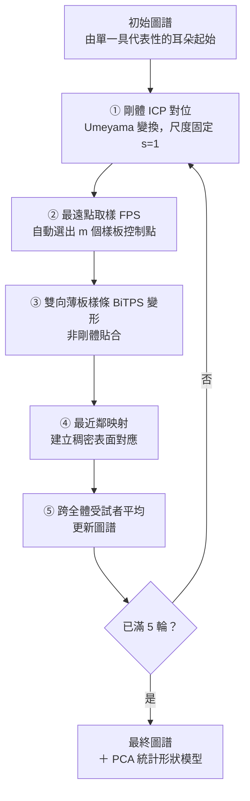

# 免標註的耳甲碗圖譜管線

**ICP ＋ 雙向薄板樣條變形，把每隻耳朵直接配準到圖譜上**

*Sensors* 2026 ｜ 文獻導讀

---

## 1. 出處

Zhang, T., Lee, T.K.W., Huang, J., Leung, K.L., Fu, S.N.
**An Annotation-Free Pipeline for 3D Auricular Bowl Atlas Construction and Statistical Shape Modelling from Surface Scans.**
*Sensors*, 2026, 26(11): 3493.

| 項目 | 值 |
|---|---|
| DOI | [10.3390/s26113493](https://doi.org/10.3390/s26113493) |
| PMID | 42281011 |
| PMCID | [PMC13259287](https://europepmc.org/articles/PMC13259287) |
| 授權 | 開放取用（Open Access），CC BY |
| 首次發表日 | 2026-06-01 |
| 研究單位 | 香港理工大學（倫理審查 HSEARS20230705002） |

---

## 2. 研究目標與問題

### 一句話總結

**不需要任何人工標記的地標，就能把 50 隻耳朵全部配準到同一個耳甲碗（auricular bowl）圖譜上，並從中導出一個可解釋的低維統計形狀模型。**

| 宣稱 | 內容 |
|---|---|
| **免標註可行** | 全流程無人工地標，控制點由最遠點取樣自動選出 |
| **配準品質足夠** | 五輪迭代後平均最近鄰距離 0.30 mm、覆蓋率 0.98 |
| **產出的尺寸可信** | 模型導出的碗高／碗寬對上人工量測 Pearson r ≥ 0.98、ICC ≥ 0.98 |

### 它要解決的問題

三維耳部形態對下列設計都是關鍵——

- 入耳式助聽器（in-the-ear hearing aids）
- 耳機（earphones）
- 經皮耳迷走神經刺激（transcutaneous auricular vagus nerve stimulation, taVNS）電極
- 耳廓重建（auricular reconstruction）

**但多數既有的耳形模型仍依賴人工放置的地標**（manually placed landmarks），代價是：

| 問題 | 說明 |
|---|---|
| 人力成本 | 每隻耳朵都要有人點座標 |
| 標註者間變異 | 同一個「耳屏頂點」不同人點在不同位置 |
| 難以規模化 | 樣本數一大就做不動 |

**本文的做法**：把地標整條路徑拿掉，改用「反覆把每隻耳朵變形貼到當前圖譜上」來建立對應關係。

---

## 3. 它做的是哪一塊：耳甲碗的確切範圍

論文明確以**排除耳垂的耳甲碗**（lobule-excluded auricular bowl）為目標區域。

| | 解剖構造 |
|---|---|
| ✅ **納入** | 耳甲腔（cavum conchae）、耳甲艇（cymba conchae）、三角窩（triangular fossa）、對耳輪（antihelix） |
| ❌ **排除** | 耳垂（lobule）、耳道開口（ear canal opening） |

**裁切方式**：於 Geomagic Design X 中人工裁切出區域邊界，再等向重新網格化（isotropically remeshed）至約 **4×10⁴ ～ 6×10⁴** 個三角面。

> ⚠️ **「免標註」指的是免地標，不是全自動。** 區域裁切這一步仍是人工的——但它只需要框出一塊範圍，不需要點出具名的解剖點位，兩者的重複性要求差很多。
>
> ⚠️ **範圍比中文「耳甲碗」的字面意思大。** 它把三角窩與對耳輪也含進來，也就是連碗緣外側那一圈結構一起納入。要引用其尺寸前須先確認範圍定義。

---

## 4. 資料

| 項目 | 內容 |
|---|---|
| 樣本數 | **50 隻耳朵／50 位受試者** |
| 側別 | **僅右耳** |
| 性別 | 男 25、女 25 |
| 年齡 | **13 – 45 歲** |
| 取得方式 | EinScan Pro HD 結構光掃描器（Shining 3D） |
| 空間解析度 | 約 **0.2 mm** |
| 前處理 | Geomagic Design X 人工裁切 → 等向重新網格化至 4×10⁴–6×10⁴ 三角面 → 依三角形面積加權取樣 20,000 點 |
| 資料集性質 | 自行採集，未使用公開資料集 |

**判斷可外推性時必須注意的兩點：**

1. **只有右耳。** 本研究不涉及左右差異，其圖譜與統計形狀模型不能直接套用到左耳（需鏡射，而鏡射是否成立本文未檢驗）。
2. **年齡上限 45 歲。** 樣本不含中高齡族群，下限 13 歲則含青少年。要外推到年長使用者須另有依據。

---

## 5. 管線總覽

外層共執行 **K = 5** 輪迭代（five atlas iterations）。

**兩層迴圈要分清楚：**

| 層級 | 迴圈內容 | 終止條件 |
|---|---|---|
| **內層** | ICP 自身的反覆對位 | 平均平方最近鄰距離的降幅低於預設容差 |
| **外層** | 整條管線（ICP → FPS → BiTPS → 對應 → 平均） | 固定 **K = 5** 輪 |

---

## 6. 步驟①：剛體 ICP 對位

**ICP ＝ 迭代最近點（iterative closest point）。** 把兩個形狀對齊的經典演算法：反覆地①假設「離我最近的點就是對應點」→②解出讓配對距離平方和最小的剛體變換→③套用後重新找最近點，如此循環直到改善幅度低於容差。配對與對位互相帶動，一開始錯的配對會隨著形狀靠近而變準。

**目的**：把每隻耳朵擺到與當前圖譜同一個位置與朝向——這一步**只搬動、不改形狀**。

| 設定 | 值 | 意義 |
|---|---|---|
| 變換求解 | Umeyama 變換 | 由點對應解出最佳剛體變換的標準閉式解 |
| **尺度** | **固定 s = 1** | **不做縮放**——耳朵的絕對大小被保留為真實的個體差異，不被歸一化掉 |
| 取樣點數 | 每個網格 20,000 點 | 依三角形面積加權（triangle-area-weighted）取樣，避免密集小三角面區域被過度取樣 |
| 收斂條件 | 平均平方最近鄰距離的降幅低於預設容差 | — |

> ⚠️ **「剛體」（rigid）意味著只准旋轉與平移**，整個形狀像硬板一樣被搬動。ICP 對完之後兩隻耳朵只是擺到了同一個位置與朝向，**形狀差異一點都沒消掉**——消形狀差異是下一步雙向薄板樣條的工作。ICP 另一個已知性質是只保證收斂到局部最佳解，初始位置偏差過大會卡住。

> 📌 **尺度固定 s = 1 是個重要選擇。** 若允許縮放，所有耳朵會被拉成同樣大小，統計形狀模型就只剩「形狀」而沒有「尺寸」。固定 s = 1 意味著後續主成分裡第一個模態通常就是整體大小。

---

## 7. 步驟②③：控制點自動選取與雙向薄板樣條

### ② 最遠點取樣（farthest point sampling, FPS）

從樣板上**自動**選出 m 個控制點：每次挑一個離已選點集最遠的點，如此反覆。

> 🔑 **這一步就是「免標註」的關鍵。**
> 傳統做法：人工點出「耳屏頂點」「耳輪腳起點」等**具名**地標當控制點。
> 本文做法：FPS 選出的控制點**沒有解剖名稱**，只保證在表面上分布均勻。變形只需要「一組分布得開的控制點」，不需要它們有名字。

### ③ 雙向薄板樣條（bidirectional thin-plate spline, BiTPS）

薄板樣條是一種非剛體變形：給定控制點的位移，求出一個讓整個曲面「彎曲能量最小」的平滑變形場。

**「雙向」的意思**：不只把樣板往目標推，也把目標往樣板拉，兩個方向的變形一起解。

其效果可由第 9 頁的誤差表直接看出：BiTPS 欄的四項指標在每一輪都明顯優於純 ICP 欄。

---

## 8. 步驟④⑤：建立對應與更新圖譜

### ④ 最近鄰映射建立稠密表面對應

變形後，樣板上的每個點去找目標表面上離它最近的點——這就建立了**稠密表面對應**（dense surface correspondences）。

「稠密」意味著對應不是幾十個地標，而是整個曲面上兩萬個取樣點逐點都有配對。這是後續能做主成分分析的前提：**所有耳朵必須用同樣長度、同樣語意順序的向量來表示。**

### ⑤ 跨全體受試者平均以更新圖譜

把 50 隻耳朵在對應之後的形狀取平均，得到新的圖譜，回到步驟①再跑一輪。

> **為什麼要迭代 5 輪**：初始圖譜只是「某一隻具代表性的耳朵」，帶著那個人的個體特徵。每平均一次，圖譜就更接近母體的平均形狀，下一輪的配準也就更容易。誤差表顯示這個收斂確實發生了。

---

## 9. 結果：五輪迭代的配準誤差

四項指標，第 1 輪 → 第 5 輪：

| 指標 | 單純 ICP：第1輪 → 第5輪 | **加上 BiTPS：第1輪 → 第5輪** |
|---|---|---|
| 平均最近鄰距離 (mm) | 2.10 → 0.93 | **0.71 → 0.30** |
| 最大最近鄰距離 (mm) | 8.92 → 2.97 | **3.73 → 1.32** |
| 對稱 Chamfer-L2 距離 | 13.46 → 5.47 | **1.47 → 0.71** |
| 覆蓋率（coverage，τ 門檻） | 0.61 → 0.89 | **0.92 → 0.98** |

### 這張表要怎麼讀

> ⚠️ **兩欄不是「兩種互斥方法的比較」。** ICP 是剛體對位，BiTPS 是接在 ICP 之後的非剛體變形——它們是同一條管線的前後兩段。並列是為了顯示 BiTPS 這一段帶來多少額外增益。

**三個可讀出的結論：**

1. **迭代有效**：每一欄從第 1 輪到第 5 輪都在改善，四項指標無例外。
2. **BiTPS 貢獻很大**：即使只跑第 1 輪，BiTPS 的平均誤差（0.71 mm）就已優於 ICP 跑滿五輪的結果（0.93 mm）。
3. **最終量級**：平均 0.30 mm。對照掃描器本身約 0.2 mm 的空間解析度，配準殘差已接近量測解析度的量級。
